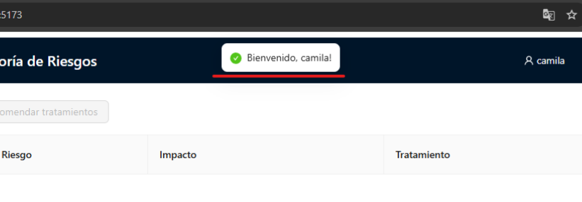

# Informe de Auditoría de Sistemas - Examen de la Unidad

#### Curso: Auditoría de Sistemas

#### Nombres y Apellidos:
 Cabrera Catari, Camila Fernanda (2021069824)

#### URL Github:
[Link repositorio](https://github.com/ccabrerastu/ExamenUnidadI_Cabrera)

https://github.com/ccabrerastu/ExamenUnidadI_Cabrera

---

## I. Proyecto de Auditoría de Riesgos

### 1. Login

Descripción: Dentro de la interfaz del login ya podemos acceder con cualquier usuario y password ficticios, pero no se puede dejar los campos vacios. 

Descripción: Se modificó el Login.jsx para que el inicio de sesión sea ficticio, permitiendo que cualquier usuario pueda ingresar con cualquier nombre de usuario y contraseña, siempre que no estén vacíos. En lugar de validar credenciales predefinidas, ahora se genera un token aleatorio y se almacena en localStorage, y se mantiene la funcionalidad de verificación de sesión y cierre de sesión mediante isAuthenticated() y logout().

Descripción: Modificado el login ficticio, se observa que ya podemos acceder con cualquier usuario y contraseña. 

### 1.1. Motor de Inteligecia Artificial

Descripción:  Se mejoró el formulario de ingreso de activos agregando un Select para que el usuario pueda elegir el tipo de activo de manera controlada, en lugar de ingresar texto libre, lo que permite asociar cada activo con su categoría correspondiente (Base de Datos, Aplicación, Infraestructura, Seguridad, etc.) y generar recomendaciones más precisas. Además, se definió un const llamado tratamientoPorTipo que mapea cada tipo de activo con un arreglo de posibles tratamientos de seguridad, como por ejemplo 'Base de Datos' con 'Copias de seguridad periódicas', 'Cifrado de datos sensibles' y 'Monitoreo de accesos a la base de datos', lo que permite que el sistema sugiera automáticamente medidas apropiadas al agregar un nuevo activo.

### 2. Hallazgos

#### Activo 1 "Servidor de base de datos"

- Condición: Pérdida del servidor de base de datos, lo cual podría afectar la disponibilidad de la información crítica para el funcionamiento de la organización.
- Recomendación: Monitoreo de accesos a la base de datos
- Riesgo: Probabilidad Alta

#### Activo 2 "API Transacciones"

- Condición: Pérdida o mal funcionamiento de la API de transacciones, lo que puede interrumpir procesos financieros o de intercambio de datos entre sistemas.
- Recomendación: Autenticación robusta y validación de inputs
- Riesgo: Probabilidad Media

#### Activo 3 "Autenticación MFA"

- Condición: Pérdida o falla en el sistema de autenticación multifactor (MFA), lo que comprometería la seguridad de los accesos a la información crítica.
- Recomendación: Actualización de firmware y software
- Riesgo: Probabilidad Alta

#### Activo 4 "Logs de Seguridad"

- Condición: Pérdida o manipulación de los logs de seguridad, lo cual dificultaría la detección de incidentes y auditorías de seguridad.
- Recomendación: Clasificación de información
- Riesgo: Probabilidad Media

#### Activo 5 "Infraestructura en la nube"

- Condición: Pérdida de la infraestructura en la nube, afectando servicios críticos y disponibilidad de aplicaciones.
- Recomendación: Monitoreo continuo de sistemas
- Riesgo: Probabilidad Alta

